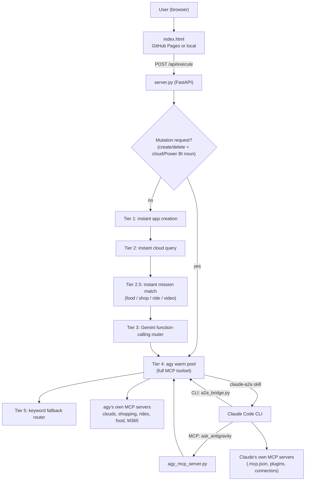

# AI Orchestration Studio: Full Capability Reference

A single reference for everything this workspace can do: the Studio product, its backend pipeline, every MCP server, the Claude Code ↔ Antigravity (A2A) bridge, media/video generation, deployment, and the known gaps.

> **How this was written:** from the code and config in this repo (`server.py`, `*_mcp_server.py`, `mcp_servers/`, `a2a_bridge.py`, `agy_mcp_server.py`, `.mcp.json`, `.claude/settings.json`, `CLAUDE.md`, `SKILL.md`, `SESSION_NOTES.md`, `VIDEO_GENERATION.md`) plus the MCP tools connected to the Claude Code session on 2026-09-20. Items marked ⚠️ are things that look configured but are not proven working. See [§13 Known gaps](#13-known-gaps-and-cautions).

---

## Contents

1. [What it is](#1-what-it-is)
2. [Architecture at a glance](#2-architecture-at-a-glance)
3. [The 16 Studio capabilities](#3-the-16-studio-capabilities)
4. [Backend: `server.py` and the tiered pipeline](#4-backend-serverpy-and-the-tiered-pipeline)
5. [HTTP API](#5-http-api)
6. [MCP servers: the repo's own](#6-mcp-servers-the-repos-own)
7. [MCP servers: connected to Claude Code this session](#7-mcp-servers-connected-to-claude-code-this-session)
8. [A2A: Claude Code ↔ Antigravity (`agy`)](#8-a2a-claude-code--antigravity-agy)
9. [Media and video generation](#9-media-and-video-generation)
10. [Power BI / SharePoint engine](#10-power-bi--sharepoint-engine)
11. [Deployment and hosting](#11-deployment-and-hosting)
12. [Configuration and secrets](#12-configuration-and-secrets)
13. [Known gaps and cautions](#13-known-gaps-and-cautions)
14. [Quick command cheat-sheet](#14-quick-command-cheat-sheet)

---

## 1. What it is

**AI Orchestration Studio** turns plain-English requests into finished deliverables: cloud queries and provisioning, deployed web apps, dashboards, shopping and ride comparisons, marketing posts, and animated videos. A static web front end (`index.html`) sends a prompt to a FastAPI backend (`server.py`). The backend picks the cheapest capable way to answer, from a keyword fast-path up to a full autonomous agent (`agy`) that drives dozens of MCP tools.

There are two AI agents in the workspace, wired together:

| Agent | Binary | Role |
|---|---|---|
| **Claude Code** | `claude` | Coding, refactoring, review, and the tools listed in [§7](#7-mcp-servers-connected-to-claude-code-this-session). |
| **Antigravity (`agy`)** | `agy` | Google's agentic CLI (Gemini reasoning). Has its **own independent** MCP config (`~/.gemini/config/mcp_config.json`). Does the unattended real-resource work in production. |

**Headline claim (from `SKILL.md`):** what takes industry weeks or months, delivered in minutes from plain English. Treat the timings there as marketing, not measurements.

---

## 2. Architecture at a glance



Two deployments run the same `server.py`:

- **Local laptop** (Windows): must run as a native Windows Python process. It reaches `agy` through `wsl.exe -e`.
- **Production** on an Oracle Cloud Always-Free VM: systemd service `ai-studio.service`, nginx on 443/80 → `127.0.0.1:8000`.

The laptop and the VM each have their **own separate `agy` install and MCP config**. They are not the same agent.

---

## 3. The 16 Studio capabilities

From `VIDEO_GENERATION.md`, `index.html`, `server.py`, and the README.

| # | Capability | What it does | Backed by |
|---|---|---|---|
| 1 | **Autonomous App Creator** | Builds an app from one sentence, deploys to the user's GitHub Pages, using Google Stitch for UI. | `stitch_app_engine.py`, `github_mcp_server.py` |
| 2 | **Autonomous Website Creator** | Same, with SaaS, Healthcare and Fintech templates. Site chrome is localised. | `stitch_app_engine.py` |
| 3 | **Visual Best Deal Finder** | Upload a product photo (Gemini vision) or type a query; compares Amazon, Flipkart, Blinkit, Zepto, Meesho. Filters by title-match relevance. | `find_best_deals_across_platforms` |
| 4 | **Connected Accounts** | Checks which provider logins/tokens are live. | `check_account_logins` |
| 5 | **Zomato vs Swiggy** | Dish-level price/ETA comparison. | `compare_food_delivery_zomato_swiggy` |
| 6 | **Ola / Uber / Rapido compare** | Fare estimates, single provider or three-way, with book-action links. | `get_*_ride_estimate`, `compare_*` |
| 7 | **3D Pixar animation** | Cinematic 1080p animated stories with neural voiceover and synthesised music. | `hybrid_video_engine.py`, `render_movie.py` |
| 8 | **Video Generation** | Text-to-video and talking-character video. | `hf_video_engine.py`, `mcp_servers/` |
| 9 | **AWS + OCI FinOps → Power BI** | Cost data normalised and pushed to Power BI. | `aws_finops_mcp_server.py`, `oci_mcp_server.py`, `powerbi_engine.py` |
| 10 | **Azure FinOps AI** | Azure cost by service, invoices. | `azure_mcp_server.py` |
| 11 | **Quad-Cloud FinOps** | AWS, Azure, GCP and OCI in one view, with FinOps guide (PDF) citations. | `query_*_cost`, `search_finops_guide` |
| 12 | **OCI Ampere VM** | Claims the Always-Free 4 OCPU / 24 GB ARM shape (retry harvester with jittered backoff). | `oci_mcp_server.py` |
| 13 | **Multi-Cloud DR** | Cross-cloud disaster-recovery workflows. | agy + cloud MCP servers |
| 14 | **Power Automate** | Author, list, enable/disable, delete flows. | `power_automate_mcp_server.py`, `flowagent` |
| 15 | **Power BI & PBIX** | Generates Power BI projects (`.pbip`/TMDL) from SharePoint CSVs; lists reports and local `.pbix`. | `powerbi_engine.py` |
| 16 | **Job Finder & Résumé Tailor** | Upload résumé, scan jobs (SerpAPI), tailor résumé to a posting. | `/api/resume/*` |

**Planned #17, "Daily Content":** automated daily 30-second video. Designed, not started. See [§9](#9-media-and-video-generation).

**UI languages:** `en, hi, es, te, kn, bn, fr, de` (8), plus `mai` (Maithili) accepted by the backend. Non-English answers get a "Respond entirely in <language>" directive prepended.

---

## 4. Backend: `server.py` and the tiered pipeline

`server.py` (~5,150 lines, FastAPI + uvicorn) is the single backend. Each request becomes a **task** held in an in-memory dict, with `logs`, `answer`, `deliverable` and `status` (`PROCESSING` → `COMPLETED`).

### Routing, cheapest first (`run_pipeline` → `_run_pipeline_tiers`)

| Order | Tier | Cost / latency | Notes |
|---|---|---|---|
| 0 | **Mutation guard** (`is_mutation_request`) | none | A mutation verb + a cloud/Power BI/SharePoint noun **skips every fast-path and goes straight to `agy`**. If `agy` fails, the user gets an honest "nothing was changed" message instead of a fake listing. |
| 1 | `try_instant_app_creation` | no LLM | Builds and deploys an app to the user's GitHub via Stitch. |
| 2 | `try_instant_cloud_query` | no LLM | Read-only keyword fast-path for cost/compute/storage/services on aws/gcp/azure/oci. |
| 2.5 | `try_instant_mission_match` | no LLM | Food, shopping, ride, video handlers. |
| 3 | `run_gemini_pipeline` | 1 LLM call | Gemini function-calling over ~35 declared tools (below). |
| 4 | `run_agy_pipeline` | slow, powerful | Warm pool of `agy` processes with the full MCP toolset. |
| 5 | Fallbacks | | Gemini direct-answer, then keyword `run_mission_pipeline`. |

Any unhandled exception is caught at the top of `run_pipeline`, so a task never sticks at `PROCESSING`.

### Gemini fast-path tools (declared in `_gemini_tool_declarations`)

| Group | Tools |
|---|---|
| **Cloud read** | `query_compute`, `query_storage`, `query_cost`, `query_services`, `query_all_resources`, `search_finops_guide` (each takes `provider`: aws / oci / azure / gcp / all) |
| **Build & deploy** | `create_github_repo`, `create_and_deploy_app` |
| **Shopping / food** | `find_best_deals`, `compare_food_delivery` |
| **Rides** | `get_ola_ride_estimate`, `get_ola_electric_models`, `get_uber_ride_estimate`, `compare_uber_vs_ola`, `get_rapido_ride_estimate`, `compare_rapido_vs_uber_vs_ola` |
| **Accounts** | `check_account_logins` |
| **WhatsApp marketing** | `whatsapp_generate_marketing_copy`, `whatsapp_send_marketing_message`, `whatsapp_send_media_campaign`, `whatsapp_send_interactive_buttons`, `whatsapp_abandoned_cart_recovery`, `whatsapp_check_account_status` |
| **Facebook marketing** | `facebook_generate_post_copy`, `facebook_publish_post`, `facebook_create_ad_campaign`, `facebook_check_page_status` |
| **LinkedIn B2B** | `linkedin_generate_thought_leadership_post`, `linkedin_publish_post`, `linkedin_b2b_lead_outreach`, `linkedin_check_account_status` |
| **Microsoft 365 / BI** | `list_sharepoint_csv_files`, `query_m365_graph`, `generate_powerbi_dashboard` |

### The `agy` warm pool

- `AgyWarmSession` keeps a persistent `agy` process speaking **NDJSON `stream-json`** over stdin/stdout, so turns after the first skip the cold start.
- `AgyWarmPool` (size `AGY_POOL_SIZE`) picks an unlocked session, or round-robins.
- A background **reaper** closes idle sessions. Startup also pre-warms the Power BI / SharePoint cache.
- On Linux it starts `agy` in its own process group so a timeout kills the MCP children too. This fixed a bug where 58+ orphan processes hung the host. On Windows the process is launched via `wsl.exe -e`.
- Runs with `--dangerously-skip-permissions` (no human is present to approve tool calls) and a JSON schema (`agy_book_schema.json`) for structured "book action" output.

### Other backend features

- **Book actions:** `build_book_action(s)` turns provider results into safe, validated deep-links (`_is_safe_http_url`) for booking or ordering.
- **Direct cloud SDK queries** for the fast-paths: boto3 (EC2, S3, Lambda/ECS, Cost Explorer), OCI SDK, Azure `azure-mgmt-*`, GCP Compute / Storage / BigQuery / Cloud Run / Functions.
- **FinOps PDF search:** fetches provider FinOps guides, does lightweight passage search, and cites the source.
- **GitHub helpers:** user profile, repo listing, repo creation, GitHub Pages.

---

## 5. HTTP API

| Method | Path | Purpose |
|---|---|---|
| `POST` | `/api/execute` | Submit a task: `{prompt, category, image_data?, location, github_user?, github_token?, language}` → `{task_id}` |
| `GET` | `/api/stream/{task_id}` | SSE log stream until completion |
| `GET` | `/api/status/{task_id}?since=N` | **Polling** alternative. Exists because Cloudflare quick tunnels kill long-lived SSE connections. Prefer this for slow `agy` tasks. |
| `GET` | `/api/health` | `{status, engine, active_tasks}` |
| `GET` | `/api/github/user`, `/api/github-repos` | GitHub profile and repos |
| `POST` | `/api/github/login` | Token or username login |
| `POST` | `/api/resume/upload` | Extract text from PDF/DOCX résumé |
| `POST` | `/api/resume/scan` | Job search via SerpAPI |
| `POST` | `/api/resume/tailor` | Async résumé tailoring → `task_id` |
| `POST` | `/ask-gcp` | GCP Q&A. ⚠️ Returns **hard-coded sample data** for savings questions (see §13). |

CORS is open (`allow_origins=["*"]`).

---

## 6. MCP servers: the repo's own

All are Python **FastMCP** (or the `mcp` SDK's `MCPServer`) over **stdio**. Several have a `*_wrapper.py` that handles SIGTERM cleanly so `agy` can reap them.

### Cloud

| Server | File | Tools |
|---|---|---|
| **azure-mcp** | `azure_mcp_server.py` | `azure_list_subscriptions`, `azure_list_resource_groups`, `azure_list_vms`, `azure_vm_action`, `azure_list_storage_accounts`, `azure_cost_by_service`, `azure_list_invoices`, `azure_run_script` |
| **gcp-mcp** | `gcp_mcp_server.py` | `gcp_list_projects`, `gcp_list_instances`, `gcp_instance_action`, `gcp_list_buckets`, `gcp_create_always_free_vm`, `gcp_cost_by_service`, `gcp_audit_log_lookup`, `gcp_run_script` |
| **oci-mcp** | `oci_mcp_server.py` | `list_instances`, `get_instance`, `instance_action`, `list_compartments`, `list_buckets`, `cost_by_service`, `audit_search`, `run_oci_script` |
| **aws-finops-mcp** | `aws_finops_mcp_server.py` | `aws_cost_by_service`, `aws_cost_forecast`, `aws_cloudtrail_lookup`, `aws_freetier_status` |

The `*_run_script` tools execute **arbitrary Python** against the provider SDK. That is powerful and dangerous. See §13.

### Developer, Microsoft, media

| Server | File | Tools |
|---|---|---|
| **github-mcp** | `github_mcp_server.py` | `github_get_authenticated_user`, `github_list_repositories`, `github_get_repo_details`, `github_enable_pages`, `github_create_and_deploy_repo`, `github_modify_and_push_repo` |
| **power-automate-mcp** | `power_automate_mcp_server.py` | `powerplatform_list_environments`, `powerplatform_list_flows`, `powerplatform_get_flow`, `powerplatform_set_flow_state`, `powerplatform_delete_flow` |
| **hf-video** | `mcp_video_server.py` | `generate_text_to_video` (Hugging Face; needs `HF_TOKEN`) |
| **hedra** | `mcp_servers/hedra_mcp_server.py` | `get_hedra_config_status`, `hedra_create_talking_character`, `hedra_get_job_status`, `hedra_download_video`, `hedra_batch_generate_movie_scenes` (**paid API**) |
| **video-ai** | `mcp_servers/video_ai_mcp_server.py` | `get_video_ai_config_status`, `luma_generate_video`, `luma_get_status`, `luma_download_video`, `kling_generate_video`, `kling_get_status`, `stitch_movie_scenes` (**paid APIs**) |

### Also documented (in `mcp-integrations.md`, config lives outside the repo)

`aws-mcp` (boto3: EC2, S3, Bedrock), `powerbi` (push datasets, DAX), `microsoft-365` (Node, `@softeria/ms-365-mcp-server`), `flowagent` (Power Automate), `apollo-io` (B2B enrichment), `canva`, `clipchamp`, `stitch` (Google Stitch UI), `puppeteer-browser` (headless Chrome).

### Google Stitch (`.claude/settings.json`)

HTTP MCP at `https://stitch.googleapis.com/mcp`, authenticated with `X-Goog-Api-Key` from `GOOGLE_STITCH_API_KEY`. Used to generate UI screens and design tokens.

---

## 7. MCP servers: connected to Claude Code this session

What this Claude Code session can call directly (tool names are `mcp__<server>__<tool>`).

| Server | Capability |
|---|---|
| **agy** | `ask_antigravity`: hand any task to the Antigravity agent (the A2A link, §8) |
| **oci** | list instances/compartments/buckets, get/act on instance, `run_oci_script` |
| **gcloud** | `run_gcloud_command` |
| **plugin azure** | ~70 Azure tools: AKS, App Service, Cosmos, Key Vault, SQL, Storage, Monitor, Policy, Pricing, Advisor, Foundry, Terraform/Bicep, and more |
| **microsoft-365** | ~400 Graph tools: Mail, Calendar, Teams chat/channels, SharePoint, OneDrive, Excel, OneNote, Planner, To Do, Contacts, meetings and transcripts, groups |
| **plugin power-automate** (`flowagent`) | Flow create/edit/validate/publish/run, run diagnosis, connections, desktop flows, templates |
| **microsoft-learn** | Docs search, code-sample search, doc fetch |
| **claude-in-chrome** | Drive your real Chrome: navigate, click, forms, screenshots, console/network, GIF recording, JS execution |
| **canva**, **clipchamp** | Browser-automated design and video editing |
| **hf-video** | Text-to-video |
| **heygen** | Avatar video (needs OAuth: `authenticate`) |
| **Shopping / delivery / rides** | amazon, flipkart, meesho, blinkit, zepto, swiggy, zomato, uber, ola, rapido |
| **arduino** | Board detect, compile, upload, serial sessions, safety preflight |
| **claude.ai connectors** | Semrush (SEO), Claude Docs, plus OAuth-gated Adobe Marketing, Apollo.io, SE Ranking |
| **Marketing plugin connectors** (OAuth) | Ahrefs, Amplitude (US/EU), Canva, Figma, HubSpot, Klaviyo, Notion, Similarweb, Slack, Supermetrics |
| **github** | ⚠️ **Failed to connect** this session (`CONNECTION_CLOSED`). See §13. |

### Claude Code built-ins available alongside

File tools (Read/Write/Edit/Glob/Grep), PowerShell, sub-agents (`Explore`, `Plan`, `general-purpose`, `claude-code-guide`), Skills (AWS, Azure, marketing, docs, artifacts), scheduling (`/loop`, `/schedule`, cron), Artifacts (published pages), notebooks, web search/fetch.

---

## 8. A2A: Claude Code ↔ Antigravity (`agy`)

Bidirectional agent-to-agent delegation. Either agent can hand work to the other.

### Claude Code → Antigravity

| Path | How | Use it for |
|---|---|---|
| **MCP** | `mcp__agy__ask_antigravity(prompt)` served by `agy_mcp_server.py` | Preferred. Warm, persistent `agy` process; first call cold-starts (seconds), later calls reuse it. |
| **CLI bridge** | `python3 a2a_bridge.py agy "<prompt>" [--model gemini-3.7-flash-high]` | Scripted or shell use. 180 s timeout. |
| **Collaborate** | `python3 a2a_bridge.py collaborate "<goal>"` | Two-stage pipeline: `agy` writes the architecture plan, then Claude Code implements from it. |
| **Status** | `python3 a2a_bridge.py status` | Binary paths and versions for both agents. |

**When to delegate to `agy`** (from the repo `CLAUDE.md`):

- Google Stitch UI generation and design-token extraction
- Power BI DAX semantic models and push datasets
- Hyperscaler tasks (AWS, Azure, GCP, OCI, including Ampere VM automation)
- Creative media (Canva, Clipchamp timelines)
- Anything needing one of `agy`'s own MCP tools this session lacks, or real files written inside WSL

### Antigravity → Claude Code

The skill `.agents/skills/claude-a2a/SKILL.md` tells `agy` how to call Claude Code through a `claude-code` MCP server:

- `claude_run_prompt(prompt, model, workspace_dir, session_id, system_prompt, timeout_seconds)`
- `claude_code_task(task_description, file_paths, system_prompt, model, workspace_dir)`
- `claude_review_code(code_or_diff, review_criteria, model)`
- `claude_inspect_status()`

Or via the shell: `python3 a2a_bridge.py claude "<prompt>"`, which runs `claude -p ... --output-format json` and returns `session_id`, `cost_usd`, `duration_ms` and the result.

### Observability: `a2a_monitor.py`

A live timeline of both agents' activity. It reads Claude Code session transcripts (`~/.claude/projects/*/*.jsonl`, `~/.claude/history.jsonl`) and Antigravity's brain and history (`~/.gemini/antigravity-cli/`), so you can see who asked what, and when.

### The `agy` wire protocol (do not improvise)

Command: `agy -p= --input-format stream-json --output-format stream-json --dangerously-skip-permissions`. Send `{"event":"user","message":{"role":"user","content":<prompt>}}` per line. Read events: `step_update` (tool calls) until a `result` event `{status, response, structured_output}`. Note `-p=` must have the `=`, otherwise `-p` swallows the next flag. Recent commits also recover the final answer from a `finish` tool call when `result` is empty.

### Two A2A generations

`a2a_bridge.py` still points at `/home/keysh/antigravity_mcp_server.py` and `/home/keysh/claude_mcp_server.py`. Those live **outside the repo**. The in-repo `agy_mcp_server.py` is the maintained path.

---

## 9. Media and video generation

### 3D Pixar / cinematic stories (`render_movie.py`, `hybrid_video_engine.py`)

- Scene art: Imagen-style prompts → frames with Pillow compositing.
- **Voiceover:** Edge-TTS neural voices (`hi-IN-MadhurNeural`, `hi-IN-SwaraNeural`, etc.).
- **Soundtrack:** synthesised with NumPy/SciPy (`generate_soundtrack.py`; e.g. Bansuri flute melodies, strings). Mixed by `mix_master_audio.py`.
- **Assembly:** FFmpeg (via `imageio-ffmpeg`), zoom-pan, lower-third subtitle cards, multi-worker rendering. Output 1080p.
- `run_batch_character_video_generation.py` batches talking-character scenes (Hedra path).

### Text-to-video

`hf_video_engine.py` / `mcp_video_server.py` (Hugging Face), `video_ai_mcp_server.py` (Luma, Kling, scene stitching), `hedra_mcp_server.py` (talking characters).

### Daily 30-second micro-drama pipeline (pilot)

Full handover is in `VIDEO_GENERATION.md`. Summary:

- **Goal:** one emotional 30 s vertical (9:16, six 5 s shots) video per day promoting one Studio capability in one language, at **zero budget**.
- **Rotation:** `capability = day mod 16`, `language = (day + day div 16) mod 8`, so every capability meets every language over 128 days.
- **Source of truth:** `episodes.json`. **Renderer:** `python render_episode.py <episode_id>` → `episodes_out/<id>.mp4` (Edge-TTS voice, music with drop-out on the emotional beat, ASS subtitles via libass for Hindi/Telugu/Kannada/Bengali, exactly 30.00 s).
- **Media drop-in:** `episodes_clips/<episode_id>/shot<N>.mp4` (clip), `.png/.jpg` (slow-zoom still), `shot<N>_1.png…` (screenshot montage). Missing shots render a placeholder card.
- **State:** the renderer works and Episode 2 rendered end-to-end as an *animatic*. Real visuals, native-speaker script review and the "Daily Content" (#17) automation are **not done**.

---

## 10. Power BI / SharePoint Engine & PBIX Suite

`powerbi_engine.py` (~1,200+ lines) plus `graph_engine.py` (Microsoft Graph helper) and `@softeria/ms-365-mcp-server`.

- **Discovery & Auditing:**
  - Recursively scans and audits SharePoint CSV datasets across document libraries with fuzzy path normalization (`data_filled` $\leftrightarrow$ `filled-data`).
  - Audits Power BI Service reports, datasets, and workspaces under Entra ID (`Keshav@keyshavkarnoutlook.onmicrosoft.com`).
- **Autonomous Star-Schema Modelling & Transformations:**
  - Automatically profiles table schemas, data types, and uniqueness.
  - Detects PK-FK relationships (e.g. `CustomerID`, `StoreID`, `SKUID`, `PromoCode`) across dimension and fact tables.
  - Auto-builds a complete **Date dimension** (`Date`, `Year`, `Quarter`, `Month`, `MonthName`, `Day`, `DayOfWeek`, `DayName`, `IsWeekend`) with drill-down hierarchies.
  - Auto-generates **DAX measures**: Sums, Averages, Gross Margins, Margin %, Realized Discount %, Till Overrides, YTD, PY, and YoY % growth.
- **Corporate High-Impact Colorful Visualizations:**
  - Emits pre-built 3-page executive dashboards styled with Microsoft Fluent2 / high-contrast corporate palettes:
    - **Page 1 (Executive Overview):** 4 KPI Cards (Total Sales SAR, Gross Margin SAR, Gross Margin %, Till Overrides), Clustered Column Chart (Category Margins), Line Trend Chart, and Pivot Matrix.
    - **Page 2 (Product Analysis):** SubCategory Bar Charts & Margin Breakdown Matrix.
    - **Page 3 (Store Performance):** Regional & Store-level Performance Matrix.
- **Triple Delivery Pipeline:**
  1. **Power BI Cloud Service:** Automatically published to Power BI Cloud Workspace (`AI-Orchestration`) via Power BI REST API.
  2. **Microsoft 365 Personal OneDrive:** Automatically pushed to user's OneDrive (`/Documents/sales.pbix` and `/Documents/PowerBI/sales.pbix`) using Microsoft 365 MCP, instantly making it available in **Power BI Desktop Recent Files**.
  3. **Direct Downloads:** Standalone `.pbix` binary file and complete `.pbip` project zip.

---

## 11. Deployment and hosting

| Option | How | Notes |
|---|---|---|
| **GitHub Pages** (front end) | Settings → Pages → `main` / root | Live at `karnkeshav.github.io/ai-orchestration/`. The UI picks a backend: localhost first on localhost origins; otherwise the OCI VM, then localhost, then a Render fallback. |
| **OCI Always-Free VM** (backend) | `docker compose up -d`, or systemd `ai-studio.service` | Ubuntu, region `ap-hyderabad-1`, nginx TLS. Set `AGY_BIN` explicitly in the unit. |
| **Docker** | `Dockerfile` (python:3.11-slim, port 80), `docker-compose.yml` | |
| **Local dev** | `./start_server.sh` (uses `uv` → `.venv` → system python), port 8000 | On Windows run `server.py` natively, not inside WSL. |
| **Cloudflare Tunnel** | `cloudflared` → `localhost:8000` | Gives HTTPS; the reason `/api/status` polling exists. |

`FREE_AI_HOSTING.md` covers free-tier hosting choices.

---

## 12. Configuration and secrets

| File | Purpose |
|---|---|
| `.mcp.json` | Claude Code project MCP servers: `github`, `hf-video`, `clipchamp` |
| `.claude/settings.json` | Google Stitch HTTP MCP |
| `.claude/settings.local.json` | Local permissions |
| `~/.gemini/config/mcp_config.json` | **`agy`'s** MCP servers (separate per host) |
| `.env` (git-ignored) | Provider API keys: Gemini, Hugging Face, Kling, Hedra, SerpAPI, Stitch, etc. **Never commit.** |
| `CLAUDE.md` (root + repo) | Standing instructions for Claude Code, including the A2A rules |
| `SKILL.md` | "Master skill" summary of Studio competencies |

**Environment variables used:** `AGY_BIN`, `AGY_BIN_WSL`, `AGY_POOL_SIZE`, `AGY_TURN_TIMEOUT_SECONDS`, `CLAUDE_BIN`, `A2A_WORKSPACE`, `GEMINI_API_KEY`, `HF_TOKEN`, `GOOGLE_STITCH_API_KEY`.

`.gitignore` excludes `.env*`, keys, tokens, `*.mp4`, `.venv`, `generated_dashboards/`. It does **not** yet exclude `episodes_out/` or `episodes_clips/`.

---

## 13. Known gaps and cautions

**Reliability**

- ⚠️ **`github` MCP failed to connect this session** (`CONNECTION_CLOSED`). `.mcp.json` launches it with `python3 /home/keysh/github_mcp_server.py`, a Linux/WSL path, but the file is in the repo root and Claude Code here runs on Windows. Fix by pointing `command`/`args` at the Windows Python and the repo copy (as `hf-video` does), or launching via `wsl -e`.
- ⚠️ **Gemini tier** was disabled on 2026-09-10 (revoked/leaked key); a fresh key was later configured. Verify it is live before relying on Tier 3.
- ⚠️ **End-to-end create/delete on all four clouds has not been confirmed.** The one AWS attempt (2026-09-15) returned "agent produced no output" and created nothing.
- The fix for Power BI/pbix intent misrouting (`_POWERBI_BUILD_VERBS`) was applied to the **laptop copy only**, not the production VM. This was the top open item in `SESSION_NOTES.md`; verify whether it has since been deployed.
- `/ask-gcp` returns **hard-coded sample savings** for "savings/advisor/recommend" questions, not live data. Don't present it as real.
- `a2a_bridge.py` defaults to WSL paths (`/home/keysh/.local/bin/...`); it does not run unmodified on native Windows.

**Safety**

- `agy` runs with `--dangerously-skip-permissions` and can create, modify and delete real cloud resources unattended. The mutation guard routes such requests to it *deliberately*, so a bad prompt can have real cost or data impact.
- `azure_run_script`, `gcp_run_script`, `run_oci_script` execute arbitrary Python with your cloud credentials.
- `/api/execute` has open CORS and no authentication in the code shown. Anyone who can reach the backend URL can submit tasks that reach `agy`.
- `agy-vm-readonly` (AWS) was widened to EC2/S3/Lambda/RDS write. IAM write was requested but blocked by a safety guardrail; that is intentional, do not work around it.
- Earlier sessions found Claude Code's safety classifier blocking SSH (including mutating commands) to the production VM ("Remote Shell Writes"). As of 2026-09-21 SSH from Claude Code works for reads and writes when the owner explicitly authorizes it; if a call is blocked, hand the owner the commands to run.

**Cost / policy**

- Kling, Hedra and Luma are **paid APIs**. Keys are in `.env` but the video project deliberately does not use them without explicit go-ahead.
- Free-tier commercial-use terms for hosted video tools, and Edge-TTS terms for advertising use, are **unverified**.
- The Daily Content automation, better music, and native-speaker script review are not done.

**Hygiene**

- `SESSION_NOTES.md` still contains the VM's public IP and an SSH key filename despite claiming to redact them, and the repo is public. Remove them.
- Most new files (`a2a_*.py`, `agy_mcp_server.py`, `mcp_servers/`, `episodes*`, `CLAUDE.md`, `VIDEO_GENERATION.md`) are **untracked**.

---

## 14. Quick command cheat-sheet

```bash
# Run the backend (local)
./start_server.sh                                    # uvicorn on :8000
python -m uvicorn server:app --host 0.0.0.0 --port 8000

# Submit a task and poll it
curl -X POST localhost:8000/api/execute -H "Content-Type: application/json" \
     -d '{"prompt":"how much did I spend on aws this month","category":"general"}'
curl "localhost:8000/api/status/<task_id>?since=0"

# A2A bridge
python3 a2a_bridge.py status
python3 a2a_bridge.py agy "list my GCP instances"
python3 a2a_bridge.py claude "review server.py routing"
python3 a2a_bridge.py collaborate "add rate limiting to /api/execute"

# Watch both agents live
python3 a2a_monitor.py

# Render a daily-video episode
python render_episode.py website-creator-hi-02

# Docker
docker compose up -d
```

From inside Claude Code, hand work to Antigravity with the `ask_antigravity` MCP tool, or just ask: *"delegate this to agy"*.
