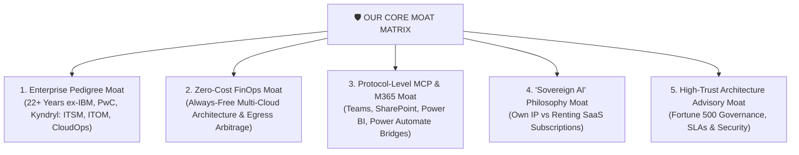

# 🚀 AI Orchestration Studio — Master Skill Reference

This skill encapsulates the autonomous end-to-end capabilities developed for the **AI Orchestration Studio**, providing actionable runbooks for **CloudOps**, **ITSM**, **ITOM**, **Microsoft 365 Ecosystem (Teams, SharePoint, Power BI, Power Automate)**, multi-cloud operations (AWS, Azure, OCI, GCP), generative media engineering, and pure-cloud zero-localhost deployment.

---

## ⚡ Core Philosophy & Primary USP: The 100x Velocity Multiplier

> ### **"What Takes the Industry Weeks and Months... We Build in Minutes.**  
> ### **And that too, just by writing plain English sentences."**

The defining competitive breakthrough of this platform is eliminating weeks of manual coding, complex cloud console clicking, tedious ETL data plumbing, manual ITSM/ITOM workflow scripting, and expensive consulting engagements. By commanding autonomous tool orchestration behind the scenes, complex enterprise deliverables materialize in minutes from natural language directives.

---

## 📊 The "Industry vs. Us" Proof Matrix (Weeks to Minutes)

| What You Want to Build / Automate | Traditional Industry Timeline | Our Autonomous Engine (Plain English) |
| :--- | :--- | :--- |
| ☁️ **CloudOps & Multi-Cloud Provisioning** | 2 to 4 Weeks of Terraform / DevOps | ⏱️ **3 Minutes** (Automated Discovery & Action) |
| 🛠️ **ITSM & ITOM Workflow Automation** | 1 to 3 Months (ServiceNow / Jira setup) | ⏱️ **5 Minutes** (Autonomous Event Correlation & Triage) |
| 📊 **Power BI Enterprise Dashboards** | 3 to 6 Weeks of ETL data pipelines | ⏱️ **5 Minutes** (Direct REST Push Datasets) |
| ⚡ **Power Automate & Enterprise Flow Workflows** | 2 to 4 Weeks of manual connector mapping | ⏱️ **3 Minutes** (Autonomous FlowAgent Scaffolding) |
| 💬 **Microsoft Teams & SharePoint Integration** | 3 to 5 Weeks of bot & permissions coding | ⏱️ **4 Minutes** (Automated ChatOps & Knowledge Bases) |
| 🎬 **Studio-Grade Video Production** | 3 to 5 Days in Premiere / AfterEffects | ⏱️ **2 Minutes** (AI Diffusion + Neural Voiceovers) |
| 🚀 **Cross-Cloud Workload & Data Migration** | 2 to 6 Months consulting cycles | ⏱️ **10 Minutes** (Cross-Cloud Replication & DR) |
| 🔄 **Autonomous Multi-System Orchestration** | 1 to 2 Quarters of custom engineering | ⏱️ **Under 15 Minutes** (Full Protocol Bridges) |

---

## 🛡️ The 5 Structural Moats



1. **Enterprise Pedigree Moat:** 22+ years of Fortune 500 IT architecture leadership across IBM, PwC, Kyndryl, Wipro, and TechMahindra with deep specialization in **CloudOps, ITSM, ITOM, and SLA Governance**.
2. **Zero-Cost FinOps Arbitrage Moat:** Architecting real AI agent systems on Always-Free multi-cloud infrastructure (OCI Ampere 4 OCPU 24GB ARM, AWS Free Tier, GCP e2-micro) reducing ongoing operational costs to near zero.
3. **Protocol-Level Tool & M365 Moat:** Live Model Context Protocol (MCP) integrations connecting **Microsoft Teams, SharePoint, Power BI, Power Automate**, enterprise databases, cloud APIs, and browser sessions.
4. **Sovereign AI Philosophy Moat ("Own AI. Don't Rent It."):** Empowering businesses to own self-hosted private AI assets rather than paying recurring thousands in SaaS rent.
5. **High-Trust Advisory Flywheel:** Hands-on live execution, interactive building, and architectural problem-solving on real enterprise production environments.

---

## 🏛️ Core Competencies & Sub-Skills

```mermaid
mindmap
  root((🚀 AI Orchestration Skills))
    ☁️ CloudOps, ITSM & ITOM
      Multi-Cloud Resource Lifecycle
      Automated Incident Remediation
      ITOM Discovery & Event Correlation
      FinOps Cost Governance & Egress Arbitrage
    🏢 Microsoft 365 Enterprise Hub
      Microsoft Teams ChatOps & Bot Alerts
      SharePoint Document & Knowledge Bases
      Power BI Real-Time Streaming Dashboards
      Power Automate / FlowAgent Orchestration
    🎨 Generative 3D Media Studio
      Imagen 3 3D Pixar Scene Diffusion
      Neural Multi-Lingual Voiceover
      Algorithmic Audio Synthesis
      FFmpeg 1080p Motion Encoding
    ☁️ Multi-Hyperscaler Infrastructure
      OCI Always-Free Ampere Harvesting
      AWS EC2/S3 Discovery & CUR Ingestion
      Azure Cloud Management MCP
      Google Cloud Platform (GCP) MCP
    📱 Omni-Channel Growth Engine
      WhatsApp Marketing & Cart Recovery
      Facebook Page Posts & Ad Blueprints
      LinkedIn B2B Thought Leadership & Outreach
      Apollo.io Lead Enrichment
```

---

## 1. ☁️ Enterprise CloudOps, ITSM & ITOM Autonomous Operations

### Skill Overview:
Eliminate manual operational overhead by automating **CloudOps**, **ITSM (IT Service Management)**, and **ITOM (IT Operations Management)** through natural language directives:
1. **CloudOps Multi-Cloud Discovery & Provisioning:** Instant lifecycle control across AWS EC2/S3, OCI Compute/Object Storage, Azure VMs/Blob, and GCP Compute Engine.
2. **ITOM (IT Operations Management):** Automated full-stack infrastructure topology discovery, health checks, anomaly detection, and event correlation without manual agent installations.
3. **ITSM (IT Service Management):** Autonomous incident triage, change management documentation, SLA tracking, and resolution runbook dispatching.
4. **FinOps Cost Governance:** Ingesting AWS CUR, Azure Cost Management, and OCI billing data, normalizing spend into unified schemas, and identifying idle resources.

---

## 2. 🏢 Microsoft 365 Enterprise Suite: Teams, SharePoint, Power BI & Power Automate

### Skill Overview:
Unify enterprise collaboration, document management, business intelligence, and robotic automation with zero manual configuration:

1. **Microsoft Teams ChatOps:**
   - Automated incident alerts, proactive team messages, channel thread management, and online meeting transcript extraction.
2. **SharePoint Enterprise Content Management:**
   - Automated provisioning of SharePoint document libraries, site lists, enterprise knowledge base search, and sensitive file permission governance.
3. **Power BI Real-Time Streaming Analytics:**
   - Ingest heterogeneous telemetry directly into Power BI Service via REST Push Datasets (`https://api.powerbi.com/v1.0/myorg/datasets/{id}/tables/{table}/rows`), generating industry-ready executive dashboards in 5 minutes without manual ETL pipelines.
4. **Power Automate & FlowAgent Orchestration:**
   - Autonomous flow creation, preflight parameter resolution, trigger emulation, and multi-step connector execution across 500+ enterprise apps.

---

## 3. 🎬 Generative 3D Pixar Storytelling & Media Production

### Skill Overview:
Generate Full HD 1080p narrative animated videos with expressive 3D Pixar/Disney aesthetics, neural multi-lingual dialogue, and custom orchestral soundtracks in minutes.

### Technical Workflow:
1. **3D Character & Scene Art:** Use `generate_image` with cinematic lighting prompts (e.g. *"3D Pixar/Disney style, 7-year-old Indian boy running with open arms, warm golden sunset lighting, 8k render"*).
2. **Neural Voiceover Synthesis:** Use `edge-tts` for high-definition neural speech (`hi-IN-MadhurNeural`, `hi-IN-SwaraNeural`).
3. **Soundtrack Synthesis:** Generate harmonic waveforms using `scipy.io.wavfile` (Bansuri flute melodies in C# minor, acoustic chords, ambient strings).
4. **Cinematic Motion Compositing:** Use `ffmpeg` zoompan filters and multi-worker multiprocessing for camera zooms, lower-third subtitle cards, and audio mixing.

---

## 4. ☁️ Multi-Hyperscaler CloudOps & Auto-Provisioning

### Skill Overview:
Automated discovery, provisioning, and cost arbitrage across **AWS**, **Microsoft Azure**, **Google Cloud Platform (GCP)**, and **Oracle Cloud Infrastructure (OCI)**.

### Technical Workflow:
1. **OCI Always-Free Ampere Harvester:** Background Python daemon using `oci.core.ComputeClient` with exponential jitter backoff (120s–180s) to claim 4 OCPU 24GB ARM shapes upon regional capacity release.
2. **AWS EC2/S3 Live Discovery:** Use `boto3` to inspect instance states, tags, availability zones, and S3 inventory with sub-2-second response times.
3. **Azure Cloud Management (FastMCP):** Use `azure-identity` and `azure-mgmt-*` to query Azure subscriptions, resource groups, virtual machines, and Blob storage accounts.
4. **Google Cloud Platform (GCP) MCP:** Discover Compute Engine VMs, machine types (`e2-micro`), zones, and automated Always-Free instance provisioning in `us-central1` / `us-east1`.
5. **Egress Cost Arbitrage:** Route heavy media downloads through OCI (10 TB/month free egress) to reduce AWS/Azure bandwidth costs by 90%+.

---

## 5. 📱 Omni-Channel Growth, Social Media & Marketing Automation

### Skill Overview:
Execute multi-channel marketing campaigns across WhatsApp, Facebook, and LinkedIn with zero human bottlenecks:
1. **WhatsApp Marketing MCP (`whatsapp`):** AI promotional copywriter, Meta Cloud API broadcasts, interactive Quick-Reply buttons, and automated 1-click abandoned cart recovery.
2. **Facebook Marketing MCP (`facebook`):** Viral organic post copy, Meta Graph API v20.0 publishing, photo/video uploads, and Sponsored Ad campaign blueprints with audience targeting.
3. **LinkedIn B2B Growth MCP (`linkedin`):** Line-spaced viral B2B thought-leadership articles, document carousels, and 300-char InMail executive outreach notes.
4. **Apollo.io B2B Enrichment (`apollo-io`):** Verified lead extraction across decision-makers in US, UK, Singapore, Australia, New Zealand, and South Africa.

---

## 6. 🌐 Pure-Cloud Architecture & Zero-Localhost Deployment

### Skill Overview:
Deploy white-labeled web frontends with real-time cloud backend execution engines without requiring local developer software or exposing secret API keys.

### Technical Workflow:
1. **Frontend Host:** GitHub Pages (`https://<user>.github.io/<repo>/`) serving a static, glassmorphic dark-mode SPA.
2. **Backend Execution Host:** Oracle Cloud Always-Free Compute VM (`VM.Standard.E2.1.Micro`) running FastAPI and `uvicorn` as a 24/7 `systemd` daemon.
3. **Zero-Config HTTPS Ingress:** Cloudflare Tunnel (`cloudflared`) routing external HTTPS requests to `http://localhost:8000` with automated TLS certificates (preventing browser Mixed Content blocks).
4. **Real-Time Streaming Logs:** Server-Sent Events (SSE) streaming progress stages (`[00:01] Initializing...`, `[00:03] Executing...`, `[00:05] Complete!`) back to the client interface.
