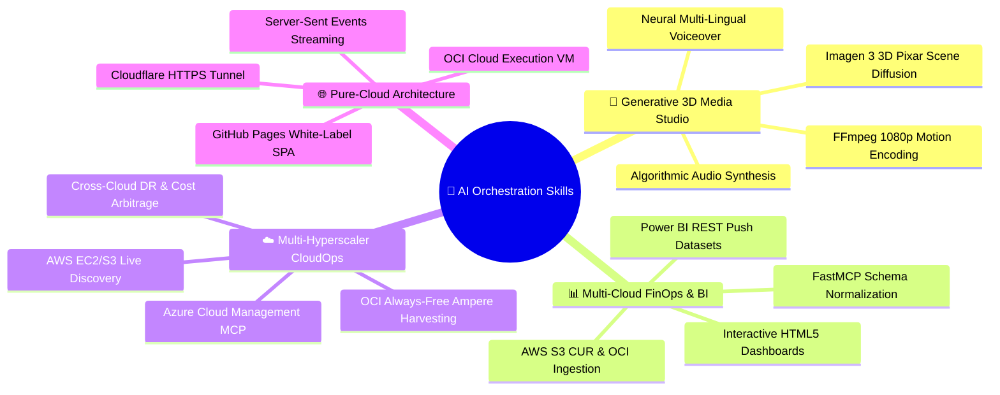

# 🚀 AI Orchestration Studio — Master Skill Reference

This skill encapsulates the autonomous end-to-end capabilities developed for the **AI Orchestration Studio**, providing actionable runbooks for multi-cloud operations, generative media engineering, real-time BI streaming, and zero-localhost cloud deployment.

---

## 🏛️ Core Competencies & Sub-Skills

---

## 1. 🎬 Generative 3D Pixar Storytelling & Media Production

### Skill Overview:
Generate Full HD 1080p narrative animated videos with expressive 3D Pixar/Disney aesthetics, neural multi-lingual dialogue, and custom orchestral soundtracks.

### Technical Workflow:
1. **3D Character & Scene Art:** Use `generate_image` with cinematic lighting prompts (e.g. *"3D Pixar/Disney style, 7-year-old Indian boy running with open arms, warm golden sunset lighting, 8k render"*).
2. **Neural Voiceover Synthesis:** Use `edge-tts` for high-definition neural speech with emotional modulation:
   - Voice models: `hi-IN-MadhurNeural` (energetic boy), `hi-IN-SwaraNeural` (loving sister).
   - Parameters: `--rate=+15%`, `--pitch=+18Hz`.
3. **Soundtrack Synthesis:** Generate harmonic waveforms using `scipy.io.wavfile` (Bansuri flute melodies in C# minor, acoustic chords, ambient strings).
4. **Cinematic Motion Compositing:** Use `ffmpeg` zoompan filters and multi-worker multiprocessing for camera zooms, lower-third subtitle cards, and audio mixing.

---

## 2. 📊 Multi-Cloud FinOps Data Harmonization & BI Streaming

### Skill Overview:
Ingest raw cloud billing and telemetry data across AWS S3 and OCI Object Storage, standardize schemas, and push directly to Power BI Service without Power Automate dependencies.

### Technical Workflow:
1. **Raw Telemetry Extraction:** Pull AWS Cost & Usage Reports (CUR) from S3 and OCI telemetry from Object Storage.
2. **Schema Normalization:** Standardize heterogeneous billing records into unified FinOps attributes (`Provider`, `Service`, `Region`, `Cost_USD`, `Usage_Hours`, `Resource_ID`).
3. **Power BI Push Datasets:** Post normalized JSON batches directly to Power BI REST endpoint (`https://api.powerbi.com/v1.0/myorg/datasets/{id}/tables/{table}/rows`).
4. **Interactive HTML Dashboards:** Build standalone Chart.js dashboards with drill-through modals, KPI cards, and cross-filtering.

---

## 3. ☁️ Multi-Hyperscaler CloudOps & Auto-Provisioning

### Skill Overview:
Automated management and discovery across **AWS**, **Microsoft Azure**, and **Oracle Cloud Infrastructure (OCI)**.

### Technical Workflow:
1. **OCI Always-Free Ampere Harvester:** Background Python daemon using `oci.core.ComputeClient` with exponential jitter backoff (120s–180s) to claim 4 OCPU 24GB ARM shapes upon regional capacity release.
2. **AWS EC2/S3 Live Discovery:** Use `boto3` to inspect instance states, tags, availability zones, and S3 inventory with sub-2-second response times.
3. **Azure Cloud Management (FastMCP):** Use `azure-identity` and `azure-mgmt-*` to query Azure subscriptions, resource groups, virtual machines, and Blob storage accounts.
4. **Egress Cost Arbitrage:** Route heavy media downloads through OCI (10 TB/month free egress) to reduce AWS/Azure bandwidth costs by 90%+.

---

## 4. 🌐 Pure-Cloud Architecture & Zero-Localhost Deployment

### Skill Overview:
Deploy white-labeled web frontends with real-time cloud backend execution engines without requiring local developer software or exposing secret API keys.

### Technical Workflow:
1. **Frontend Host:** GitHub Pages (`https://<user>.github.io/<repo>/`) serving a static, glassmorphic dark-mode SPA.
2. **Backend Execution Host:** Oracle Cloud Always-Free Compute VM (`VM.Standard.E2.1.Micro`) running FastAPI and `uvicorn` as a 24/7 `systemd` daemon.
3. **Zero-Config HTTPS Ingress:** Cloudflare Tunnel (`cloudflared`) routing external HTTPS requests to `http://localhost:8000` with automated TLS certificates (preventing browser Mixed Content blocks).
4. **Real-Time Streaming Logs:** Server-Sent Events (SSE) streaming progress stages (`[00:01] Initializing...`, `[00:03] Executing...`, `[00:05] Complete!`) back to the client interface.
