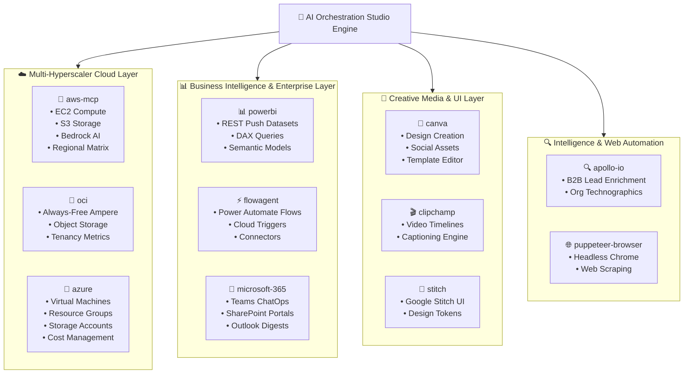

# 🔌 Enterprise Technology Stack & MCP Integrations Reference

This document catalogs the complete **Model Context Protocol (MCP) Ecosystem** powering the AI Orchestration Studio.

---

## 🗺️ MCP Architecture Map

---

## 📋 Comprehensive MCP Server Inventory (11 Servers)

| Server ID | Technology Stack | Transport | Primary Purpose & Tools |
| :--- | :--- | :--- | :--- |
| **`azure`** | FastMCP, `azure-identity`, `azure-mgmt-compute`, `azure-mgmt-resource`, `azure-mgmt-storage` | Stdio (Python) | **Azure Cloud Management:** Virtual Machines, resource groups, storage accounts, subscriptions, and custom Azure SDK scripts. |
| **`aws-mcp`** | Python, `boto3`, AWS SDK | Stdio (Python) | **AWS Cloud Operations:** EC2 instance management, S3 storage buckets, Bedrock AI models, regional availability. |
| **`oci`** | Python FastMCP, OCI Python SDK | Stdio (Python) | **Oracle Cloud Infrastructure:** Always-Free Ampere VM harvesting, Object Storage buckets, tenancy management. |
| **`powerbi`** | Python, Power BI REST API | Stdio (Python) | **Power BI Streaming:** Real-time push dataset ingestion, DAX semantic model querying, report automation. |
| **`microsoft-365`** | Node.js, `@softeria/ms-365-mcp-server` | Stdio (Node) | **Microsoft 365 Graph:** Teams incident cards, SharePoint enterprise lists, Outlook email digests, OneDrive files. |
| **`flowagent`** | Node.js, Power Automate MCP | Stdio (Node) | **Power Automate RPA:** Cloud flow authoring, trigger emulation, connector resolution, flow publishing. |
| **`apollo-io`** | Node.js, `@rockship/apollo-io-mcp` | Stdio (Node) | **B2B Growth Intelligence:** Prospect email discovery, CTO/FinOps decision-maker enrichment, company technographics. |
| **`canva`** | Python, Playwright, Canva API | Stdio (Python) | **Canva Visual Design:** Template search, automated design generation, presentation canvas exports. |
| **`clipchamp`** | Python, Playwright, Clipchamp | Stdio (Python) | **Clipchamp Video Editing:** Video timeline automation, media imports, project rendering. |
| **`stitch`** | Python, Google Stitch Design System | Stdio (Python) | **Google Stitch UI:** Screen generation from text, UI design token exports, multi-variant design systems. |
| **`puppeteer-browser`**| Node.js, `@modelcontextprotocol/server-puppeteer` | Stdio (Node) | **Headless Web Automation:** Web scraping, automated screenshots, SPA end-to-end evaluation. |

---

## 🛡️ Enterprise Security & Secrets Management
- **Localhost Elimination:** All MCP servers execute in isolated backend runtime environments.
- **Zero Exposed Keys:** Authentication is managed via server-side IAM roles (`DefaultAzureCredential`, `boto3` IAM profiles, OCI API keys).
- **Client White-Labeling:** Public web clients interact strictly with high-level prompt directives and finished deliverables.

### 12. ⚪ Google Cloud Platform (`gcp`) MCP Server
* **Engine:** `FastMCP` with `google-cloud-compute`, `google-cloud-storage`, `google-cloud-resource-manager`, `google-auth`
* **Tools Exposed:**
  * `gcp_list_projects`: Discovers all accessible GCP projects.
  * `gcp_list_instances`: Enumerates Compute Engine VMs, machine types (`e2-micro`), zones, and external IPs.
  * `gcp_instance_action`: Lifecycle controls (`start`, `stop`, `reset`, `delete`).
  * `gcp_list_buckets`: Scans Google Cloud Storage (GCS) buckets.
  * `gcp_create_always_free_vm`: 1-click provisioning of Always-Free `e2-micro` instances in `us-central1`, `us-east1`, or `us-west1`.
  * `gcp_run_script`: Executes dynamic Python SDK workflows against Google Cloud.
